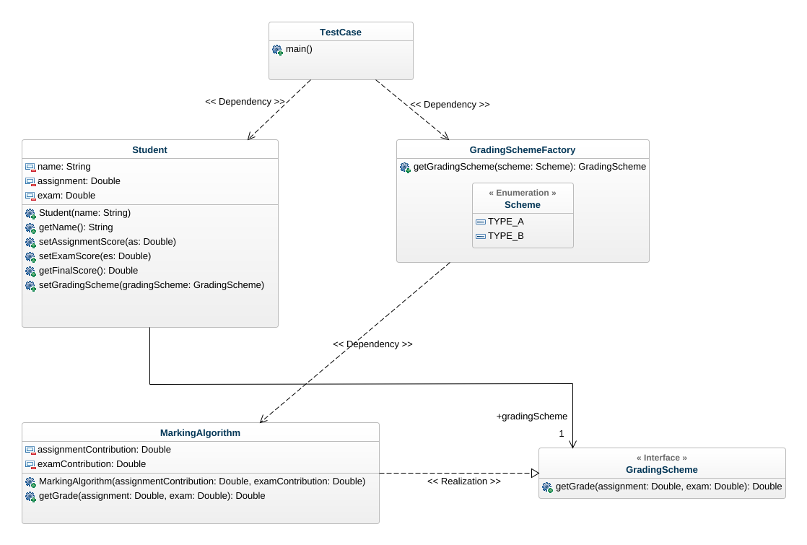

# Software Methodology 11.15
## WangYuyang 19372316

## Design Pattern

The design pattern I chose is the **factory pattern**. First, in this program the user wants to create a grading algorithm, as long as he knows its name, and does not need to care about its specific implementation. Secondly, the extensibility is high, if needed to add a new grading algorithm, just change the factory class. At last, Shielding the specific implementation of the product, the caller only needs to care about the interface of the product

## Class Diagram



## Code

### GradingScheme.java

```java
public interface GradingScheme {
    public double getGrade(double assignment, double exam);
}
```

### GradingSchemeFactory.java

```java
public class GradingSchemeFactory {
    public static enum Scheme {
        TYPE_A,
        TYPE_B
    }
    public GradingScheme getGradingScheme(Scheme scheme){
        if(scheme == Scheme.TYPE_A){
            return new MarkingAlgorithm(0.4,0.6);
        }
        else if(scheme == Scheme.TYPE_B){
            return new MarkingAlgorithm(0.5,0.5);
        }
        throw new RuntimeException("Unknown scheme");
    }
}
```

### MarkingAlgorithm.java

```java
public class MarkingAlgorithm implements GradingScheme {
    private double assignmentContribution;
    private double examContribution;

    public MarkingAlgorithm(double assignmentContribution, double examContribution) {
        if ((assignmentContribution < 0 || assignmentContribution > 1) 
                || (examContribution < 0 || examContribution > 1)) {
            throw new RuntimeException(
                    "The assignment contribution and " +
                            "exam contribution should be " +
                            "between 0 and 1, now: " +
                            assignmentContribution + 
                            " " + 
                            examContribution);
        }
        if ((assignmentContribution + examContribution) != 1) {
            throw new RuntimeException("The sum of assignment contribution and " +
                    "exam contribution should be " +
                    "1, now: " + 
                    (assignmentContribution + examContribution));
        }
        this.assignmentContribution = assignmentContribution;
        this.examContribution = examContribution;
    }

    @Override
    public double getGrade(double assignment, double exam) {
        return assignmentContribution * assignment + examContribution * exam;
    }
}

```

### Student.java

```java
public class Student {

	private String name;        // full name of the student
	private Double assignment;  // score for the assignment
	private Double exam;        // score for the exam
	private GradingScheme gradingScheme;
	
	/**
	 * Construct the student from their name
	 * @param name full name of the student
	 */
	public Student(String name) {
		this.name = name;
		assignment = 0.0;
		exam = 0.0;
	}

	/**
	 * @return the student's full name
	 */
	public String getName() {
		return name;
	}

	/**
	 * @param as the assignment score to set
	 */
	public void setAssignmentScore(double as) {
		assignment = as;
	}
	/**
	 * @param es the exam score to set
	 */
	public void setExamScore(double es) {
		exam = es;
	}

	// TODO get the final score
	public Double getFinalScore() {
		if(gradingScheme == null) {
			throw new RuntimeException("Grading scheme not set");
		}
		return gradingScheme.getGrade(assignment, exam);
	}

	public void setGradingScheme(GradingScheme gradingScheme) {
		this.gradingScheme = gradingScheme;
	}
}
```

### TestCase.java

```java
public class TestCase {

    public static void main(String[] args) {

        Student student = new Student("Harry Potter");
        student.setAssignmentScore(88);
        student.setExamScore(66);

        GradingSchemeFactory factory = new GradingSchemeFactory();
        // TODO switch to algorithm A:
        student.setGradingScheme(
                factory.getGradingScheme(
                        GradingSchemeFactory.Scheme.TYPE_A
                ));
        System.out.println(
                student.getName()
                        + "  "
                        + student.getFinalScore().toString());

        // TODO switch to algorithm B 
        student.setGradingScheme(
                factory.getGradingScheme(
                        GradingSchemeFactory.Scheme.TYPE_B
                ));
        System.out.println(
                student.getName()
                        + "  "
                        + student.getFinalScore().toString());
        
        // Customizable Grading
        student.setGradingScheme(new GradingScheme() {
            @Override
            public double getGrade(double assignment, double exam) {
                return 0;
            }
        });

    }

}
```

## Output

```shell
Harry Potter  74.80000000000001
Harry Potter  77.0

```


